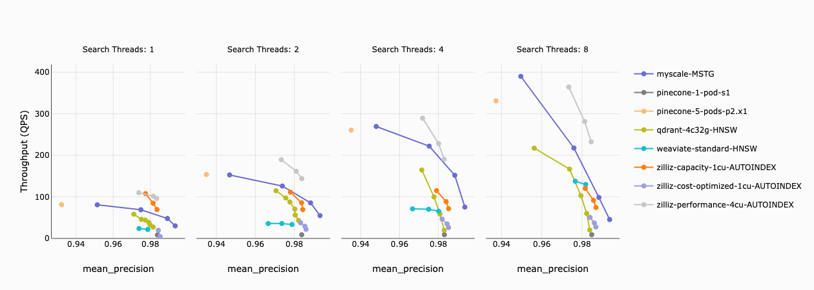
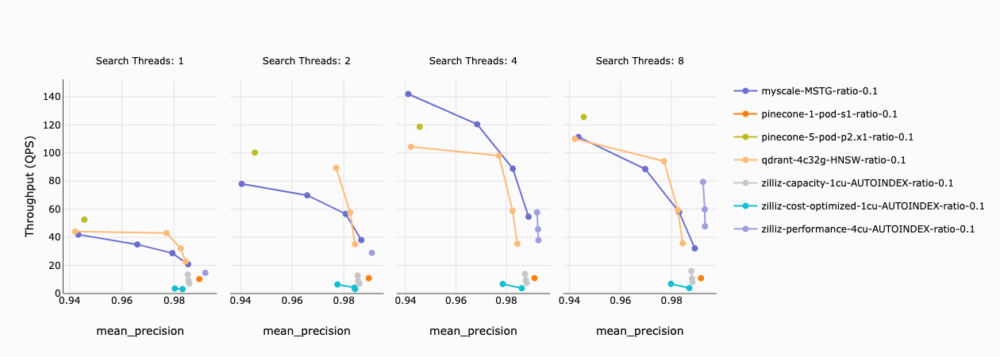
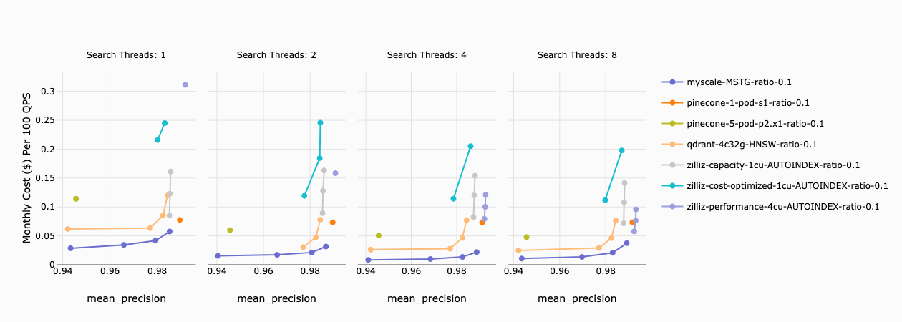

# MyScale Vector Database Benchmark 🚀

> [!IMPORTANT]
> Visit <https://myscale.github.io/benchmark/#/benchmark> for results.

This benchmark assesses the performance of **fully-managed** vector databases with typical workloads.

- For the setup, datasets, and detailed results of the benchmark, please visit <https://myscale.github.io/benchmark>.
- A summary of the benchmark results is available in our [blog post](https://blog.myscale.com/myscale-outperform-specialized-vectordb/).

Here's a preview of the results:

1. **Queries Per Second (QPS):** Higher QPS is preferable as it signifies greater throughput.
   - Throughput for Vector Search
   
   - Throughput for Filtered Vector Search
   
2. The **cost-performance ratio** is calculated by dividing the monthly cost by the QPS of the services per one hundred units. A lower ratio suggests better cost effectiveness.
   - Cost-performance ratio for Vector Search
   
   - Cost-performance ratio for Filtered Vector Search
   

## Run the Benchmark

First, install the necessary libraries on the client used for the benchmark.

```shell
pip install -r requirements.txt
```

Afterwards, follow the [Step-by-Step Guide for Benchmark](docs/step-by-step-guide-for-benchmark.md) to execute the benchmark for each cloud service. You can refer to [Results Visualization](docs/results-visualization.md) for visualizing the test results.

## Special Thanks

This repository is a fork of [qdrant/vector-db-benchmark](https://github.com/qdrant/vector-db-benchmark/), specifically tailored for fully-managed vector databases.
