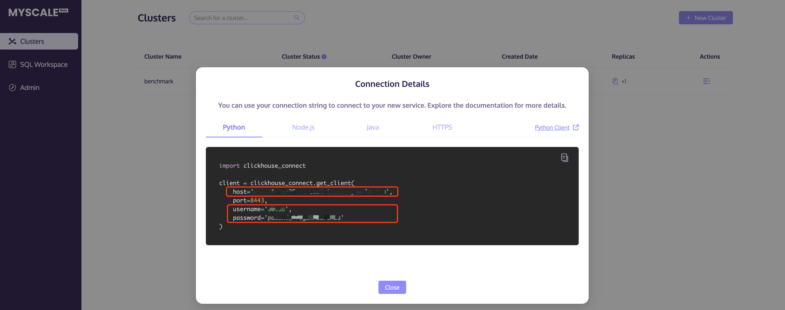
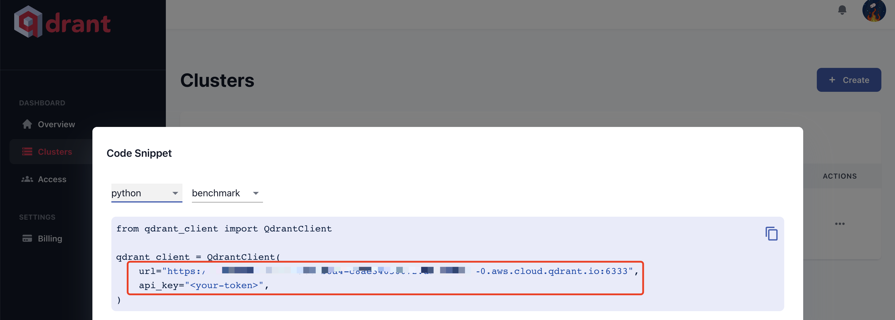

# vector-db-benchmark: a benchmark for vector databases


> [View results](https://blog.myscale.com/2023/05/12/myscale-outperform-special-vectordb/)

## Introduction

This benchmark is used to test typical workload on vector databases, and it's a fork of [qdrant/vector-db-benchmark](https://github.com/qdrant/vector-db-benchmark/).  We have added support for cloud services like MyScale, Pinecone, Weaviate Cloud, Qdrant Cloud, and Zilliz Cloud. We use the LAION 5M dataset in this benchmark:

| Dataset name             | Description                                                                                                                               | Number of vectors | Number of queries | Dimension | Distance | Filters                             | Payload columns | Download link                                                                                     |
|--------------------------|-------------------------------------------------------------------------------------------------------------------------------------------|-------------------|-------------------|-----------|----------|-------------------------------------|-----------------|---------------------------------------------------------------------------------------------------|
| laion-768-5m-ip          | Provided by MyScale. Generated from [LAION 2B images](https://huggingface.co/datasets/laion/laion2b-multi-vit-h-14-embeddings/tree/main). | 5,000,000         | 10000             | 768       | IP       | N/A                                 | 0               | [link](https://myscale-datasets.s3.ap-southeast-1.amazonaws.com/laion-5m-test-ip.hdf5)            |

## Preparation

You need to install the required libraries on the client used for testing.

```shell
pip install -r requirements.txt
```

## Testing steps

For any cloud vector database, the testing process follows the flowchart below:


Below are the specific testing processes for each cloud vector database.

### MyScale

#### Step 1. Create Cluster

Go to the [MyScale official website](https://myscale.com/) and create a cluster.  In the [cluster console](https://console.myscale.com/clusters), record the cluster connection information: `host`, `port`, `username`, and `password`.



#### Step 2. Modify the configuration

We have provided two configuration files for testing MyScale:

- [myscale_cloud_mstg_laion-768-5m-ip.json](experiments/configurations/myscale_cloud_mstg_laion-768-5m-ip.json)
- [myscale_cloud_mstg_arxiv-titles-384-angular.json](experiments/configurations/myscale_cloud_mstg_arxiv-titles-384-angular.json)

You need to write the cluster connection information obtained in Step 1 into the configuration files.  To modify the configuration files for testing, open each file and locate the `connection_params` section.  Update the values for `host`, `port`, `user`, and `password` with the appropriate cluster connection information obtained in Step 1.

Here is an example of how the modified section may look:

```shell
"connection_params": {
  "host": "your_host.aws.dev.myscale.cloud",
  "port": 8443,
  "http_type": "http",
  "user": "your_username",
  "password": "your_password"
},
```

### Step 3. Run the tests

```shell
python3 run.py --engines *myscale*
```

### Step 4. View the test results

```shell
cd results
grep -E 'rps|mean_precision' $(ls -t)
```


### Pinecone

#### Step 1. Create Cluster

Register with [Pinecone](https://docs.pinecone.io/docs/overview) and obtain the cluster connection information for
`Environment` and `Value`.


#### Step 2. Modify the configuration

We have provided two configuration files for testing Pinecone:

- [pinecone_cloud_s1_laion-768-5m-ip.json](experiments/configurations/pinecone_cloud_s1_laion-768-5m-ip.json)
- [pinecone_cloud_s1_arxiv-titles-384-angular.json](experiments/configurations/pinecone_cloud_s1_arxiv-titles-384-angular.json)

- You need to write the cluster connection information obtained in Step 1 into the configuration files.
- Modify the `connection_params` section of the files and update the values for `environment` and `api_key`.

Here is an example of how the modified section may look:

```shell
"connection_params": {
  "api-key": "your_api_key",
  "environment": "your_environment"
},
```

### Step 3. Run the tests

```shell
python3 run.py --engines *pinecone*
```

### Step 4. View the test results

```shell
cd results
grep -E 'rps|mean_precision' $(ls -t)
```


### Zilliz

#### Step 1. Create Cluster

You need to find the cluster connection information, including `end_point`, `user`, and `password`,
in the [Zilliz Cloud console](https://cloud.zilliz.com/projects/MA==/databases).
The `user` and `password` are the credentials you specified when creating the cluster.


#### Step 2. Modify the configuration

We have provided two configuration files for testing Zilliz:

- [zilliz_cloud_1cu_storage_optimized_laion-768-5m-ip.json](experiments/configurations/zilliz_cloud_1cu_storage_optimized_laion-768-5m-ip.json)
- [zilliz_cloud_1cu_storage_optimized_arxiv-titles-384-angular.json](experiments/configurations/zilliz_cloud_1cu_storage_optimized_arxiv-titles-384-angular.json)

You need to write the cluster connection information obtained in Step 1 into the configuration files.
To modify the configuration files for testing, open each file and locate the `connection_params` section.
Update the values for `end_point`, `cloud_user`, and `cloud_password` with the appropriate cluster connection information obtained in Step 1.

Here is an example of how the modified section may look:

```shell
"connection_params": {
  "cloud_mode": true,
  "host": "127.0.0.1",
  "port": 19530,
  "user": "",
  "password": "",
  "end_point": "https://your_host.zillizcloud.com:19538",
  "cloud_user": "your_user",
  "cloud_password": "your_password",
  "cloud_secure": true
},
```

### Step 3. Run the tests

```shell
python3 run.py --engines *zilliz*
```

### Step 4. View the test results

```shell
cd results
grep -E 'rps|mean_precision' $(ls -t)
```


### Weaviate Cloud

#### Step 1. Create Cluster

Register with [Weaviate Cloud](https://console.weaviate.cloud/dashboard) and create a cluster.
Record the cluster connection information: `cluster URL` and `Authentication`.


#### Step 2. Modify the configuration

We have provided two configuration files for testing Weaviate Cloud:

- [weaviate_cloud_standard_arxiv-titles-384-angular.json](experiments/configurations/weaviate_cloud_standard_arxiv-titles-384-angular.json)
- [weaviate_cloud_standard_laion-768-5m-ip.json](experiments/configurations/weaviate_cloud_standard_laion-768-5m-ip.json)

You need to write the cluster connection information obtained in Step 1 into the configuration files.
Modify the `connection_params` section of the files and update the values for `host` and `api_key`.
The `host` corresponds to the `cluster URL`, and the `api_key` is the `Authentication`.

Here is an example of how the modified section may look:

```shell
"connection_params": {
  "host": "https://your_host.weaviate.cloud",
  "port": 8090,
  "timeout_config": 2000,
  "api_key": "your_api_key"
},
```

### Step 3. Run the tests

```shell
python3 run.py --engines *weaviate*
```

### Step 4. View the test results

```shell
cd results
grep -E 'rps|mean_precision' $(ls -t)
```


### Qdrant

#### Step 1. Create Cluster

Register with [Qdrant Cloud](https://cloud.qdrant.io/) and create a cluster.
Record the cluster connection information: `URL` and `API key`.


#### Step 2. Modify the configuration

We have provided three configuration files for testing Qdrant:

- [qdrant_cloud_hnsw_2c16g_storage_optimized_laion-768-5m-ip.json](experiments/configurations/qdrant_cloud_hnsw_2c16g_storage_optimized_laion-768-5m-ip.json)
- [qdrant_cloud_hnsw_2c16g_storage_optimized_arxiv-titles-384-angular.json](experiments/configurations/qdrant_cloud_hnsw_2c16g_storage_optimized_arxiv-titles-384-angular.json)
- [qdrant_cloud_quantization_2c16g_storage_optimized_laion-768-5m-ip.json](experiments/configurations/qdrant_cloud_quantization_2c16g_storage_optimized_laion-768-5m-ip.json)

You need to write the cluster connection information obtained in Step 1 into the configuration files.
Modify the `connection_params` section of the files and update the values for `host` and `api_key`.
Please note that for the `connection_params` section, you need to remove the `port` from the end of the `host` string.
Here is an example of how the modified section may look:

```shell
"connection_params": {
  "host": "https://your_host.aws.cloud.qdrant.io",
  "port": 6333,
  "grpc_port": 6334,
  "prefer_grpc": false,
  "api_key": "your_api_key"
},
```

### Step 3. Run the tests

```shell
python3 run.py --engines *qdrant*
```

### Step 4. View the test results

```shell
cd results
grep -E 'rps|mean_precision' $(ls -t)
```


